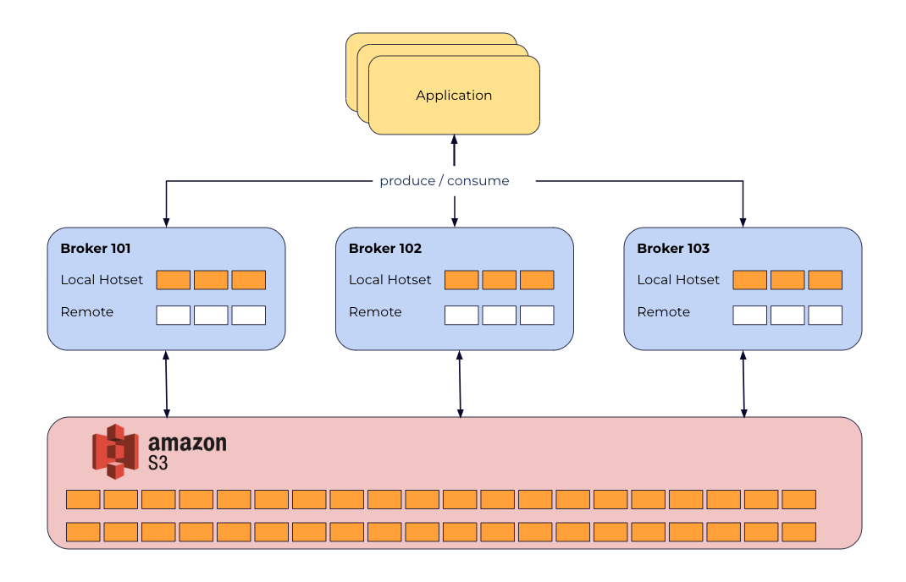
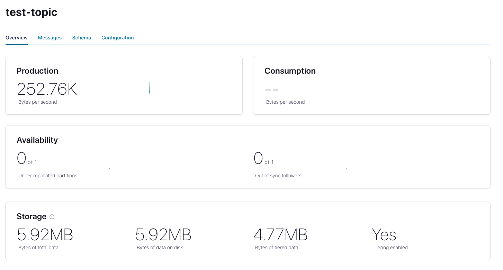
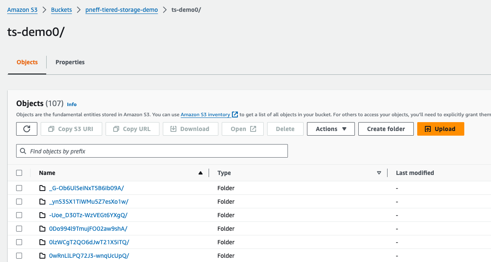

# CP Tiered Storage



## Resources
* [Tiered Storage](https://docs.confluent.io/platform/current/kafka/tiered-storage.html#aws)

## S3
Create a S3 bucket and store/create corresponding permission keys.

## Brokers

We mount a credentials file containing `accessKey` and `secretKey` into the container and
we add to the broker configuration:

```yaml
KAFKA_CONFLUENT_TIER_FEATURE: "true"
KAFKA_CONFLUENT_TIER_METADATA_REPLICATION_FACTOR: 1
KAFKA_CONFLUENT_TIER_TOPIC_DELETE_CHECK_INTERVAL: 60000
## AWS S3
KAFKA_CONFLUENT_TIER_BACKEND: S3
KAFKA_CONFLUENT_TIER_S3_BUCKET: "pneff-tiered-storage-demo"
KAFKA_CONFLUENT_TIER_S3_REGION: "eu-central-1"
KAFKA_CONFLUENT_TIER_S3_PREFIX: "ts-demo"
KAFKA_CONFLUENT_TIER_S3_CRED_FILE_PATH: /home/appuser/credentials.txt
```


## Create topic
```shell
kafka-topics --bootstrap-server localhost:9092   \
  --create --topic test-topic \
  --partitions 1 \
  --replication-factor 1 \
  --config confluent.tier.enable=true \
  --config confluent.tier.local.hotset.ms=30000 \
  --config segment.bytes=2000000
```

## Produce
```shell
kafka-producer-perf-test \
   --producer-props bootstrap.servers=localhost:9092 \
   --topic test-topic \
   --record-size 1000 \
   --throughput 1000 \
   --num-records 3600000
```

## Verify Tiered Storage




## Consume
```shell
kafka-console-consumer \
  --bootstrap-server localhost:9092 \
  --topic test-topic \
  --from-beginning      
```


## Delete
```shell
kafka-topics \
  --bootstrap-server localhost:9092 \
  --delete \
  --topic test-topic \  
```

The files in the S3 bucket are deleted after some period (`confluent.tier.topic.delete.check.interval.ms` = 1 min) too.